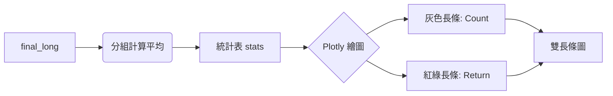

# Analysis Step 2 (統計與繪圖) 詳細運作原理解析

這份文件詳細解釋了 Notebook 中 **Part 2 - Analysis Step 2** 的運作邏輯。這是您用來生成「雙長條圖（樣本數 + 平均報酬）」的關鍵區塊。

## 1. 核心邏輯流程

這個區塊做了三件主要工作：
1.  **排序 (Sorting)**：定義 `s+1`、`e-1` 這些標籤誰先誰後。
2.  **統計 (Aggregation)**：把成千上萬筆資料，按天算平均。
3.  **繪圖 (Plotting)**：畫出含有雙 Y 軸的圖表。

---

## 2. 程式碼逐段解析

### A. 定義排序規則 (`parse_t_val`)
因為電腦不懂 `s+1` 比 `s-1` 大，所以我們要寫一個翻譯機：

```python
def parse_t_val(t_str):
    # 如果標籤是 's-4'，就翻譯成 -4
    # 如果標籤是 's+2'，就翻譯成 2
    # 如果標籤是 'e+1'，為了讓它排在最後面，我們故意加個大數字 (例如 1000 + 1)
    ...
```
*   **目的**：確保畫出來的圖，X 軸是依照時間順序排列的 (處置前 -> 處置中 -> 解禁後)。

### B. 計算統計量 (`groupby`)
```python
target_col = 't_label_first'  # 我們只分析第一次處置
stats = final_long.groupby(target_col)['abnormal_ret'].agg(['mean', 'count', 'std']).reset_index()
```
*   **輸入**：`final_long` (包含所有股票每一天的資料)。
*   **動作**：
    1.  把标籤一樣的日子（例如所有股票的 `s+1`）抓成一堆。
    2.  算這一堆的 **`mean` (平均超額報酬)** -> 用來畫前景長條。
    3.  算這一堆的 **`count` (有幾支股票)** -> 用來畫背景長條。
*   **輸出**：一個小表格 `stats`，大概長這樣：
    | t_label | mean | count |
    | :--- | :--- | :--- |
    | s-1 | 0.5% | 1500 |
    | s+0 | -1.2% | 1500 |

### C. 呼叫繪圖函式 (`plot`)
```python
plot(
    df=stats,
    x=target_col,       # X軸: 時間標籤 (s+1, s+2...)
    ly='count',         # 左Y軸 (上圖/背景): 樣本數
    ly_type='bar',      # 設定左軸也畫「長條圖」
    bar_col='mean',     # 右Y軸 (下圖/前景): 平均報酬
    bar_kwargs={'width': 0.8} # 固定長條寬度
)
```
這是我們剛剛升級過的地方！
*   **`ly='count' + ly_type='bar'`**：
    *   這畫出了圖表上那層**淺灰色的長條**。
    *   它的高度代表「樣本數」。如果某一天忽然變矮，代表那天很多股票沒資料（可能遇到假日或沒交易）。
*   **`bar_col='mean'`**：
    *   這畫出了圖表上那層**紅綠色的長條**。
    *   **紅色**代表平均賺錢 (Process > 0)，**綠色**代表平均賠錢。

---

## 3. 這張圖怎麼看？ (觀察重點)

1.  **處置效應 (The Effect)：**
    *   看 **紅色/綠色長條**。
    *   如果在 `s+0` (處置開始日) 附近出現 **顯著的綠柱**，代表處置消息一出，股價通常會跌。
    *   如果在 `e+0` (解禁日) 附近出現 **紅柱**，代表解禁後股價會反彈。

2.  **樣本信賴度 (Reliability)：**
    *   看 **灰色長條 (Count)**。
    *   灰色柱子越高，代表這個平均值是用成千上萬筆資料算出來的，**可信度高**。
    *   如果越往右邊 (e+N) 灰色柱子越矮，代表有很多股票根本撐不到解禁（可能下市或資料缺失），這時候算出來的平均報酬可能會有偏差 (Survivorship Bias)。

## 4. 常見問題

*   **Q: 為什麼有些標籤 (`s+10`) 不見了？**
    *   A: 因為我們只取了 `head(20)` 或是資料本身過濾掉了。您可以調整程式碼中的篩選範圍。
*   **Q: 為什麼是 `abnormal_ret` 而不是 `daily_ret`？**
    *   A: 因為我們在 Step 1.5 扣掉了大盤漲跌。這樣看到的才是「因為處置而產生」的漲跌，而不是因為那天大盤剛好大漲。


